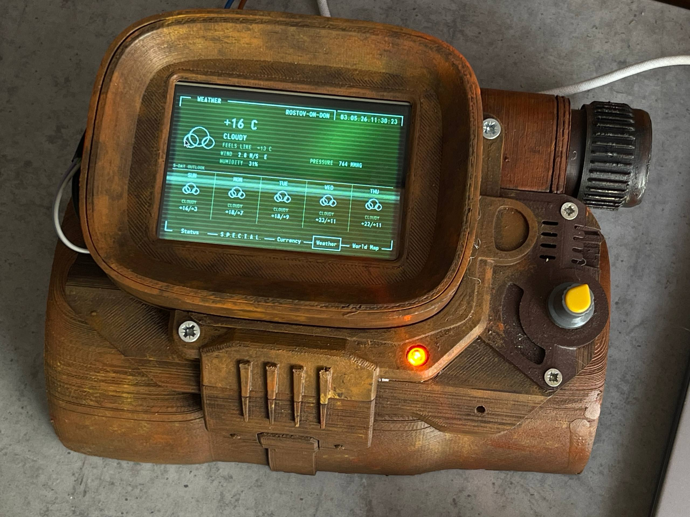

pypboy 3000
=========

Python/Pygame Pip-Boy 3000 emulator for Raspberry Pi with a 2.8" capacitive touchscreen and GPIO physical buttons.



## What's new:

Forked from [sabas1080/pypboy](https://github.com/sabas1080/pypboy) and reworked:

- **Python 3** — full migration from Python 2
- **Rotary encoder** — quadrature encoder support via GPIO with hardware debounce table
- **Currency screen** — live exchange rates (USD, EUR, CNY vs RUB via CBR; BTC, ETH, TON vs USD via CoinGecko) with PNG icons
- **Weather screen** — current conditions + 5-day forecast via Open-Meteo API, city switching via encoder
- **World clock** — multi-city clock with Nuka-Cola logo, day/date display
- **World map** — OSM map with per-city navigation, disk cache, corrected render viewport

## Hardware

- Raspberry Pi B+ 512mb (any model with GPIO)
- 2.8" capacitive TFT screen (480×320)
- Rotary encoder on GPIO pins (configured in `config.py`)
- Physical buttons via GPIO

## Running

Win
```bash
pip install -r requirements.txt
python main.py
```
Raspberry
```bash
./run.sh
```

No build step required. On non-Raspberry Pi systems GPIO import fails silently and the app runs with keyboard only.

## Controls on PC

| Key | GPIO | Action |
|-----|------|--------|
| 1–5 | knob_1–5 | Switch submodule |
| ↑ / ↓ | dial_up / dial_down | Navigate / change city |

## Configuration

Edit `config.py` to set:
- `CITIES` — coordinates and GMT offset for each city
- `WEATHER_CITY` — default city for weather
- `ENCODER_PINS` — GPIO pins for rotary encoder
- `GPIO_ACTIONS` — GPIO pin → action mapping

---

## Original README

Remember that one Python Pip-Boy 3000 project? Neither do we!<br>
Python/Pygame interface, emulating that of the Pipboy-3000.<br> 
Uses OSM for map data and has been partially tailored to respond to physical switches over Raspberry Pi's GPIO<br>

## Features

Work with Screen TFT 2.8" Capacitive of Adafruit<br>

## Autors

* By Sabas of The Inventor's House Hackerspace

* By grieve work original<br>

## Special Thanks

Ruiz Brothers for the mention in [Adafruit](https://learn.adafruit.com/raspberry-pi-pipboy-3000/overview) 

## License
MIT

##Contributions

Contribuyendo a este programa se da la bienvenida con gusto.<br>

Contributing to this software is warmly welcomed. You can do this basically by [forking](https://help.github.com/articles/fork-a-repo), committing modifications and then [pulling requests](https://help.github.com/articles/using-pull-requests) (follow the links above for operating guide). Adding change log and your contact into file header is encouraged.<br>

Thanks for your contribution.

Enjoy!
